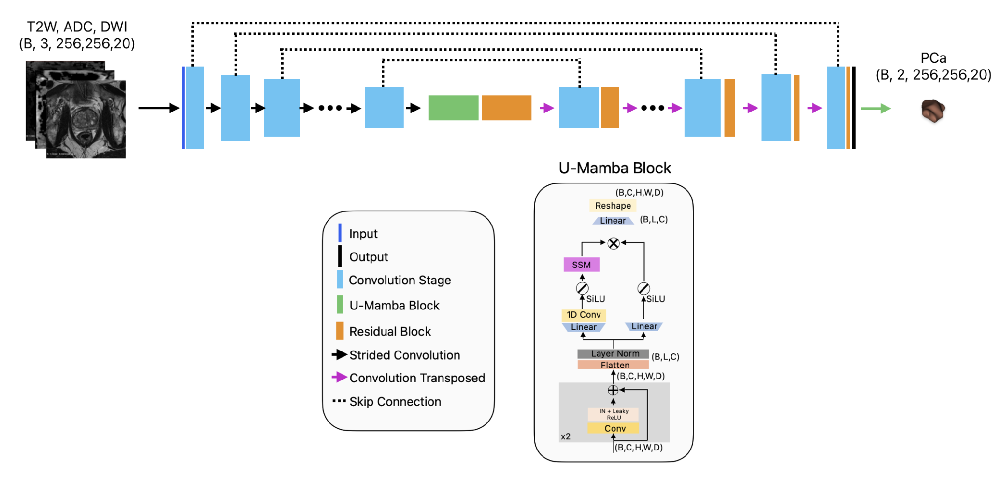
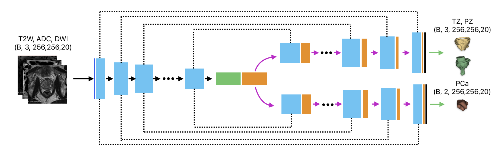

# Zonal Anatomy-Guided Prostate Cancer Detection in Bi-Parametric MRI using U-Mamba with Multi-Task Learning
This is the official code for U-Mamba MTL (Submitted to MIDL 2025)

Link to the preprint: https://openreview.net/forum?id=ZkmVQinyAE


Abstract:

Prostate cancer (PCa) remains a leading cause of cancer-related morbidity, emphasizing the need for accurate and non-invasive diagnostic tools. While deep learning models have advanced PCa detection in magnetic resonance imaging (MRI), they often fail to integrate anatomical knowledge. This study evaluates U-Mamba, a deep learning architecture designed to enhance long-range dependency modeling with linear time complexity, for PCa detection. Furthermore, a multi-task learning (MTL) extension, U-Mamba MTL, is introduced to incorporate prostate zonal anatomy, aligning with clinical diagnostic work-flows. The models were assessed using diverse datasets, including the PI-CAI hidden tuning cohort (N=100) and an in-house collected out-of-distribution cohort (N=200). Results demonstrate that U-Mamba achieves robust state-of-the-art detection performance, while U-Mamba MTL further improves PCa detection through the auxiliary zonal segmentation task. These findings highlight the potential of integrating U-Mamba with anatomical context to improve PCa detection.


## How to install:
```
conda env create --file=environment.yml
conda activate umamba_mtl
wandb login # Logging into weights and biases (required for logging during model training)
```

This will install all packages needed to run the experiments, including the shared modules in /shared_modules.
A shared module can be loaded like this:

```
from shared_modules.networks.UMambaBot_3d_mtl.py
```

## Download weights (optional):

You may choose which weights to download by changing the variables inside ``utils/download_weights.py`` (defaults to umamba_mtl only).

```
cd utils
python download_weights.py
```


## Datasets

The repository expects the datasets to be located in ``data/``. The datasets (except for our in-house dataset) can be downloaded from:

- PI-CAI dataset: [](https://doi.org/10.5281/zenodo.6624726)
- PI-CAI labels: https://github.com/DIAGNijmegen/picai_labels
- Prostate158 (training): [](https://doi.org/10.5281/zenodo.6481141)
- Prostate158 (testing): [](https://doi.org/10.5281/zenodo.6592345)
- ProstateX: Is a subset of PI-CAI

You can either make your own json datalists or use the existing lists in ``json_datalists/{dataset_id}/``.
Instructions for PI-CAI training set download and preprossessing can be seen in ``data/PI-CAI-V2.0/readme.md``.


## Local training and testing

Inside the experiments folder you will find the code for training and testing for each model (except for PI-CAI baselines).

**Configuration:**

``config.yaml`` contains the configuration for training and inference

Please note that Weights and Biases is currently used to log metrics while training. 
Replace the ``logger.project`` and ``logger.entity`` with your own wandb information, inside the ``config.yaml``, before running the trainer.


**Model training:**

Model training can be started using:

```
python trainer.py
```

**Model Assessment:**

Run the code blocks inside ``evaluate_ensemble.ipynb``
Please note that the evaluation script is set to calculate metrics on the PI-CAI training set (N=1500) as our in-house dataset is not publicly available. Although the PI-CAI training set is resampled to T2W spacing using picai_prep, the dataloader can do this on the fly by providing ["t2w","adc","hbv"] seperatily instead of ["image"].

## PI-CAI Docker Submission ##

The docker submissions for PI-CAI is structured as a base-container + specific models as tar files.

The base container can be built using the following command (within the ``gc_algorithms/base_container`` folder):

```
chmod +x build.sh
chmod +x export.sh
./export.sh
```


A spesific model can be compressed using the following command (within the ``gc_algorithms/base_container/models`` folder):
Each of these models does rely on a U-Mamba prostate segmentation model for prostate center cropping.

```
tar -czvf swin_unetr.tar.gz -C swin_unetr .
tar -czvf umamba.tar.gz -C umamba .
tar -czvf umamba_mtl.tar.gz -C umamba_mtl .
```

These files includes the model weights and the inference script for each model.
These models can then be uploaded into the algorithm on the grand challenge website.

## Architecture overview:

### Umamba
<p align="center">

</p>

### Umamba MTL
<p align="center">

</p>

## Citation

```
@inproceedings{
larsen2025prostate,
title={Prostate Cancer Detection in Bi-Parametric {MRI} using Zonal Anatomy-Guided U-Mamba with Multi-Task Learning},
author={Michael S. Larsen and Syed Farhan Abbas and Gabriel Kiss and Mattijs Elschot and Tone F. Bathen and Frank Lindseth},
booktitle={Submitted to Medical Imaging with Deep Learning},
year={2025},
url={https://openreview.net/forum?id=ZkmVQinyAE},
note={under review}
}
```


## Acknowledgements

We acknowledge the authors of the publicly available datasets used in this study, whose contributions enable valuable research. Additionally, we extend our gratitude to the developers of [Swin UNETR](https://github.com/Project-MONAI/MONAI/blob/46a5272196a6c2590ca2589029eed8e4d56ff008/monai/networks/nets/swin_unetr.py#L47-L337), [U-Mamba](https://github.com/MIC-DKFZ/nnUNet), and the PI-CAI baseline models: [nnU-Net](https://github.com/DIAGNijmegen/picai_nnunet_semi_supervised_gc_algorithm), [U-Net](https://github.com/DIAGNijmegen/picai_unet_semi_supervised_gc_algorithm), and [nnDetection](https://github.com/DIAGNijmegen/picai_nndetection_semi_supervised_gc_algorithm) for making their valuable code publicly available.


